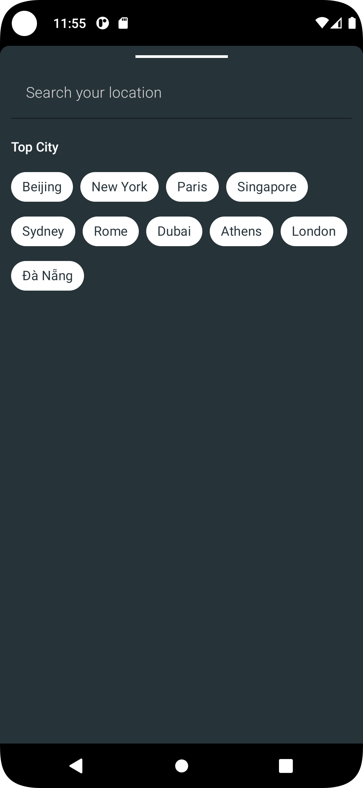

City Weather Android App
================================
This project is a sample project. That provide forecast weather feature for user. Apply Clean Architecture. Single source of truth implementation.
The weather API get from [here](https://openweathermap.org/)

## Tech stack
* [Room](https://developer.android.com/jetpack/androidx/releases/room) and [SharedPreferences](https://developer.android.com/training/data-storage/shared-preferences) use to save weather cache, city and other settings.
* [Navigation](https://developer.android.com/guide/navigation) use to navigate between fragment, show dialog and send value between two fragment.
* Retrofit + Moshi use to communicate with web service and convert Json to Object.
* [Dependency Injection with Hilt](https://developer.android.com/training/dependency-injection/hilt-android) apply dependency injection easier, one of important library need for Clean architecture.
* Rx Android.
* Coroutines.
* Glide use to load image from internet.
* Jacoco use for report code coverage.

## Project structure

All data from internet will be saved to local database and view will observer from there.

* Domain layer: all use cases, entities, value objects.
* Data layer: share preferences, database, remote API etc.
* Presentation layer: UI.

## Video	

## Images
<table>
	<tr>
    	<th></th>
    	<th></th>
    	<th></th>
	</tr>
	<tr>
    	<th></th>
    	<th></th>
    	<th></th>
	</tr>
<tr>
    	<th></th>
    	<th></th>
    	<th></th>
	</tr>
<tr>
    	<th></th>
    	<th></th>
    	<th></th>
	</tr>
	<tr>
    	<th></th>
	</tr>
</table>

## Features:
- Current weather.
- Forecast weather.
- Management cities.
- Auto update weather per 30 minutes.